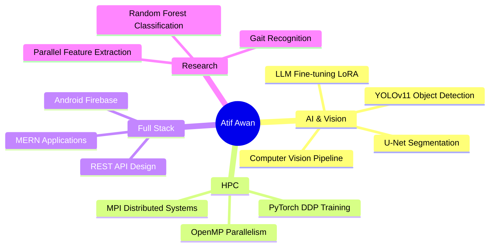

<div align="center">

<!-- Animated Header Banner -->


<!-- Typing SVG -->
<a href="https://git.io/typing-svg">
  
</a>

<br/>

<!-- Social Badges -->
[](https://www.linkedin.com/in/atif-mehmood-awan-265a9129b/)
[](https://github.com/AtifAwan559)
[](mailto:awanatif237@gmail.com)
[](https://fiverr.com)
[](https://github.com/AtifAwan559)

</div>

---

<!-- About Me -->


### 🧠 About Me

```yaml
name: Atif Awan
location: Lahore, Pakistan 🇵🇰
education:
  university: UET Lahore
  degree: BS Computer Science
  session: 2023 – 2027
  

focus_areas:
  - AI / Computer Vision
  - Parallel & Distributed Computing
  - Full-Stack (MERN + Android)
  - Machine Learning Research

currently:
  working_on: Crosswalk Safety Analyzer (CV Pipeline)
  learning:   MPI, OpenMP, Deep Learning
  exploring:  Fine-tuned LLMs & Freelancing

fun_fact: >
  I built an AI brain tumor annotator
  powered by Claude Vision API 🧠⚡
```

<br clear="right"/>

---

<!-- Stats Section -->
<div align="center">

### 📊 GitHub Analytics


<br/>


<br/>


</div>

---

<!-- Tech Stack -->
### 🛠️ Tech Stack & Tools

<div align="center">

**Languages**


**Frontend**


**Backend & Databases**


**AI / ML**


**HPC / Parallel Computing**


**DevOps & Tools**


</div>

---

<!-- Featured Projects -->
### 🚀 Featured Projects

<div align="center">

| Project | Description | Tech |
|--------|-------------|------|
| 🛣️ **[Crosswalk Safety Analyzer](https://github.com/AtifAwan559)** | 3-stage CV pipeline: ResNet-50 → YOLOv11n → U-Net for pedestrian safety scoring | `Python` `OpenCV` `Streamlit` `PyTorch` |
| 🧠 **[NeuroAnnotate](https://github.com/AtifAwan559)** | Alzheimer's MRI annotation tool with Claude Vision API auto-annotation | `Python` `Tkinter` `Anthropic API` |
| 🤖 **[LabSyncAI](https://github.com/AtifAwan559)** | AI-powered lab management platform | `MERN` `AI` |
| ⚡ **[Parallel CNN Trainer](https://github.com/AtifAwan559)** | Distributed deep learning: PyTorch DDP on MNIST, sequential vs parallel benchmarks | `Python` `PyTorch` `MPI` |
| 🗄️ **[Custom DB Engine](https://github.com/AtifAwan559)** | Built a database engine from scratch with custom query parsing | `C++` |
| 🚗 **[MERN Car Platform](https://github.com/AtifAwan559)** | Full-stack vehicle marketplace with auth, listings, and search | `MongoDB` `Express` `React` `Node.js` |
| 📱 **[Employee Manager (Android)](https://github.com/AtifAwan559)** | Firebase-backed Android CRUD app with real-time sync | `Kotlin` `Firebase` |
| 🛡️ **[VVIP Route Manager](https://github.com/AtifAwan559)** | Secure route planning system | `C#` `.NET` |

</div>

---

<!-- Certifications -->
### 🏆 Certifications & Achievements

<div align="center">


</div>

---

<!-- GitHub Trophies -->
### 🎖️ GitHub Trophies

<div align="center">


</div>

---

<!-- Snake animation -->
### 🐍 My Contribution Snake

<div align="center">
  <picture>
    <source media="(prefers-color-scheme: dark)" srcset="https://raw.githubusercontent.com/AtifAwan559/AtifAwan559/output/github-contribution-grid-snake-dark.svg"/>
    <source media="(prefers-color-scheme: light)" srcset="https://raw.githubusercontent.com/AtifAwan559/AtifAwan559/output/github-contribution-grid-snake.svg"/>
    
  </picture>
</div>

> ⚠️ **Note:** To activate the snake, set up the [GitHub Actions workflow](https://github.com/Platane/snk) in your profile repo.

---

<!-- Current Focus -->
### 🎯 Current Focus & Learning Path



---

<!-- WakaTime Stats (optional) -->
### ⏱️ Coding Activity

<!--START_SECTION:waka-->
> Set up [WakaTime](https://wakatime.com) to auto-populate your coding stats here.
<!--END_SECTION:waka-->

---

<!-- Footer wave -->
<div align="center">

### 💬 Let's Connect & Build Something Amazing

**Open to:** Freelance Projects • Research Collaboration • Open Source

[](mailto:awanatif237@gmail.com)

<br/>

*"First, solve the problem. Then, write the code."* — John Johnson

<br/>


</div>
